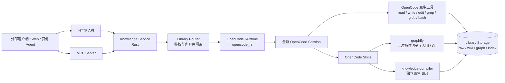
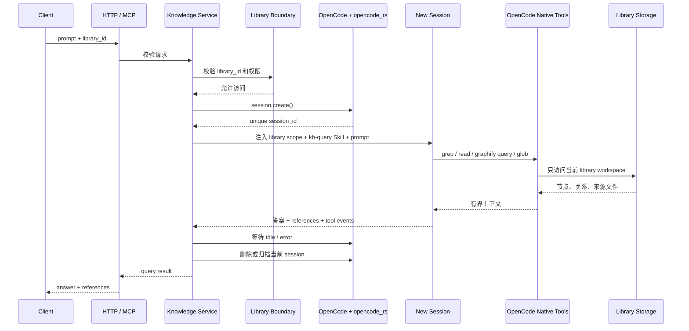
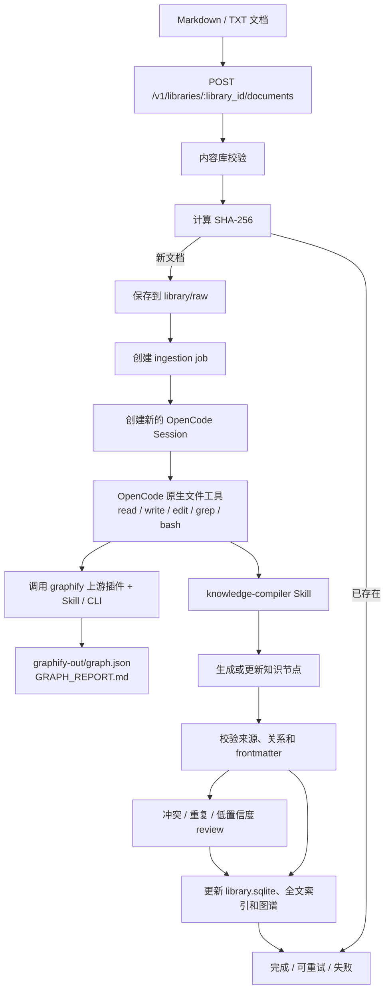
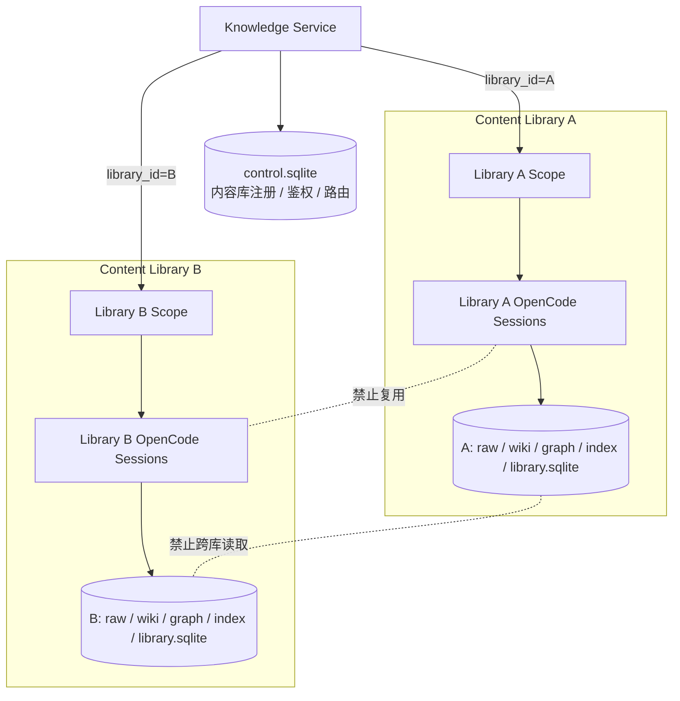

# OpenCode 驱动的文本知识库服务方案

## 参考项目与原始地址

本方案基于以下本地项目、GitHub 仓库和原始设计资料整理。

| 参考项目 / 资料 | 本地绝对路径 | GitHub 仓库 / 原始地址 |
|---|---|---|
| graphify | `/mnt/data/code/graphify` | [Graphify-Labs/graphify](https://github.com/Graphify-Labs/graphify) |
| graphify 架构说明 | `/mnt/data/code/graphify/ARCHITECTURE.md` | [ARCHITECTURE.md](https://github.com/Graphify-Labs/graphify/blob/main/ARCHITECTURE.md) |
| graphify OpenCode Skill | `/mnt/data/code/graphify/graphify/skill-opencode.md` | [skill-opencode.md](https://github.com/Graphify-Labs/graphify/blob/main/graphify/skill-opencode.md) |
| graphify OpenCode 安装器 | `/mnt/data/code/graphify/graphify/install.py` | [install.py](https://github.com/Graphify-Labs/graphify/blob/main/graphify/install.py) |
| LLM-WIKI Skill | `/mnt/data/code/LLM-WIKI` | [loonggg/LLM-WIKI](https://github.com/loonggg/LLM-WIKI) |
| LLM-WIKI Skill 定义 | `/mnt/data/code/LLM-WIKI/SKILL.md` | [SKILL.md](https://github.com/loonggg/LLM-WIKI/blob/main/SKILL.md) |
| LLM-WIKI 节点 Schema | `/mnt/data/code/LLM-WIKI/references/schema.md` | [schema.md](https://github.com/loonggg/LLM-WIKI/blob/main/references/schema.md) |
| LLM Wiki 产品实现 | `/mnt/data/code/llm_wiki` | [nashsu/llm_wiki](https://github.com/nashsu/llm_wiki) |
| LLM Wiki 中文说明 | `/mnt/data/code/llm_wiki/README_CN.md` | [README_CN.md](https://github.com/nashsu/llm_wiki/blob/main/README_CN.md) |
| LLM Wiki 原始设计文档 | `/mnt/data/code/llm-wiki.md` | [Karpathy 的 LLM Wiki Gist](https://gist.github.com/karpathy/442a6bf555914893e9891c11519de94f#file-llm-wiki-md) |
| OpenCode | `/mnt/data/code/opencode` | [anomalyco/opencode](https://github.com/anomalyco/opencode) |
| OpenCode Rust SDK | `/mnt/data/code/agentic_auxilary/crates/services/opencode-rs` | [xutianyi1999/agentic_auxilary](https://github.com/xutianyi1999/agentic_auxilary)；crate 元数据仓库：[allisoneer/agentic_auxilary](https://github.com/allisoneer/agentic_auxilary) |
| OpenCode Skills 文档 | `/mnt/data/code/opencode/packages/web/src/content/docs/skills.mdx` | [skills.mdx](https://github.com/anomalyco/opencode/blob/dev/packages/web/src/content/docs/skills.mdx) |
| OpenCode MCP 文档 | `/mnt/data/code/opencode/packages/web/src/content/docs/mcp-servers.mdx` | [mcp-servers.mdx](https://github.com/anomalyco/opencode/blob/dev/packages/web/src/content/docs/mcp-servers.mdx) |

后续实现和文档引用应优先保留对应的本地绝对路径与上游地址，方便在本地源码、GitHub 仓库和原始设计之间交叉核对。

### 接入原则

- graphify 直接使用其上游 OpenCode 安装方式，不复制或重写 graphify 的图构建、查询和插件逻辑。
- LLM-WIKI 只作为知识编译思想和设计参考，不把上游 `SKILL.md` 原样复制到本项目。
- 本项目独立设计 OpenCode 原生的知识编译 Skill，按本服务的内容库、workspace 和任务模型重新组织流程。
- 新 Skill 可以记录参考来源，但不建立对上游文件结构、命令、目录或具体步骤的运行时依赖。

## 1. 目标

构建一个对外提供知识库能力的服务：

- 输入：UTF-8 文本文档，首期支持 Markdown 和纯文本。
- 查询：只接受自然语言 prompt。
- 知识库形态：支持多个内容库，每个内容库在应用、数据和 Agent 工作范围上隔离；主机级隔离要求见安全章节。
- 项目代码：Rust。
- OpenCode 调用：使用 `/mnt/data/code/agentic_auxilary/crates/services/opencode-rs`。
- 驱动：由 OpenCode Agent Runtime 执行摄入、检索和回答。
- 测试模型：OpenCode Zen 的 DeepSeek V4 Flash Free，OpenCode 模型标识默认使用 `opencode/deepseek-v4-flash-free`。
- 对外协议：首期只支持 HTTP JSON API 和基于标准 Streamable HTTP 的 MCP，不提供 stdio、WebSocket、GraphQL 或 gRPC。
- 持久化：原始资料、知识节点、关系图、检索索引和任务状态均可恢复。

核心定位：

> Knowledge Service 是产品边界，OpenCode 是智能执行引擎，graphify 是关系图构建器，knowledge-compiler 是参考 LLM-WIKI 思想独立设计的知识编译器。

## 2. 首期范围

### 支持

- `.md`、`.txt` 文档。
- 文档按内容库隔离。
- 文档原文保存和 SHA-256 去重。
- LLM 生成知识节点、摘要、引用和概念关系。
- 全文检索、关系图遍历和基于 prompt 的综合回答。
- 查询结果返回答案、引用来源、知识节点和运行信息。
- 摄入任务的排队、状态查询、失败重试。

### 暂不支持

- PDF、Office、图片、音视频和网页 URL。
- 浏览器剪藏。
- 向量数据库和 embedding 检索。
- 跨内容库检索。
- 复用历史查询 session。
- 直接让外部客户端修改知识节点。

## 3. 总体架构

```text
外部客户端 / Web / 其他 Agent
            │
       HTTP API / MCP
            │
       Knowledge Service
   内容库、文档、任务、索引、权限
            │
     OpenCode Server / SDK
            │
       新建 OpenCode Session
            │
       Skills + OpenCode Native Tools
            │
   graphify + knowledge-compiler + Storage
```

OpenCode 作为长驻进程运行，但每个查询必须创建新的 session。新 session 只接收当前查询 prompt、内容库范围和必要的系统指令，不加载其他查询的对话历史。

“新 session”不等于“新进程”：服务可以复用 OpenCode Server 进程和模型连接，但不能复用 sessionID 或历史消息。

Knowledge Service 对外只暴露 HTTP 和 MCP。OpenCode Rust SDK 内部使用 OpenCode 的 HTTP/SSE 能力驱动 session；SDK 内部的 SSE 不作为 Knowledge Service 的第三种对外协议。

每个内容库是独立的知识边界。在应用层，内容库之间不能共享原文、知识节点、关系图、全文索引、任务上下文或查询 session；首期不提供跨内容库搜索和跨内容库 Agent 操作。OpenCode 原生命令的主机级逃逸防护见安全章节。

### 3.1 总体组件架构



### 3.2 查询生命周期与 Session 隔离



同一个 OpenCode Server 可以服务多个查询，但每个查询的 `session_id` 必须唯一；内容库的持久化知识是共享状态，查询对话历史不是共享状态。

### 3.3 文本文档摄入流水线



### 3.4 多内容库隔离边界



## 4. 组件职责

### Knowledge Service

- 校验外部输入。
- 管理内容库、文档和任务。
- 保存原始文本和生成物。
- 提供全文检索和关系图查询。
- 启动并追踪 OpenCode session。
- 聚合最终答案、引用和工具事件。
- 控制内容库权限和资源范围。

### OpenCode Runtime

- 为每次摄入创建任务 session。
- 为每次查询创建全新 session。
- 加载对应 Skill。
- 通过 OpenCode 原生文件工具访问当前内容库 project/workspace。
- 查询 session 的 `directory/worktree` 指向内容库根目录；摄入/维护 session 优先指向该内容库的 job staging worktree，并在 prompt 中明确 `library_id`、内容库根路径、`purpose.md` 和 `schema.md`。
- 生成知识节点、关系和最终回答。

### graphify

直接接入 graphify 的 OpenCode 插件和 Skill，不在 Knowledge Service 内重实现 graphify：

```bash
graphify install --platform opencode --project
```

该安装流程负责：

- 安装 `.opencode/skills/graphify/SKILL.md`。
- 安装 `.opencode/plugins/graphify.js`。
- 在 `.opencode/opencode.json` 中注册插件。

这里必须区分 graphify 的三个部分：`.opencode/plugins/graphify.js` 是上游的 `tool.execute.before` 提醒钩子，主要检查当前目录是否已有 `graphify-out/graph.json` 并提示 Agent；它本身不负责构建图。实际的图构建、更新和查询由上游安装的 `graphify` Skill 以及 graphify CLI 完成，例如 `graphify <path>`、`graphify query`、`graphify update`，具体命令以本地上游版本为准。

每个内容库的根目录就是一个独立的 OpenCode project/workspace，服务在该目录内执行上游 `graphify install --platform opencode --project`。这样 graphify 按当前工作目录生成的 `graphify-out/`、`graph.json`、`GRAPH_REPORT.md` 和缓存都会落在对应内容库范围内。Knowledge Service 只负责准备内容库 project、调用已安装的 graphify Skill/CLI、读取产物和把结果纳入内容库索引。

创建 job staging project 时，服务保留该内容库 `.opencode/` 中由上游安装的 graphify 文件，并复制 `.graphifyignore` 输入边界；graphify 插件、Skill 和配置不能被服务自定义实现替换。staging 只改变运行目录和待提交产物，不改变 graphify 的来源。空内容库只安装 graphify，不强行执行空的 `/graphify .`；首篇文档摄入执行首次全量建图，后续文档摄入执行 `/graphify . --update`。

graphify 的输入范围必须由 Skill 和内容库根目录的 `.graphifyignore` 明确限定为当前内容库的 `raw/` 文本目录，以及经过确认的 `wiki/` Markdown 节点；Agent 仍执行上游 `/graphify .` 或 `/graphify . --update` 完整流程，但不能把 `.opencode`、SQLite、索引和运行时文件误当成知识来源。服务只允许 `.md` 和 `.txt` 进入 graphify 输入，首期不启用代码 AST、网页或二进制解析。

graphify 提供：

- 节点和边。
- `EXTRACTED`、`INFERRED`、`AMBIGUOUS` 置信度。
- 社区、桥接节点和关系路径。
- 增量更新和查询预算。

首期不启用代码 AST 流程，只处理文本中的标题、链接、术语和 LLM 提取的关系。

### Knowledge Compiler（参考 LLM-WIKI）

LLM-WIKI 不作为代码或 Skill 模板直接复制。Knowledge Service 只吸收其核心思想，并独立编写一个面向 OpenCode 的知识编译 Skill，交给 OpenCode 按需加载。

独立设计时吸收的原则包括：

- 原始资料与生成知识分层保存。
- 一个核心概念对应一个可独立引用的知识节点。
- 节点必须包含来源、关系、摘要和可验证的推理依据。
- 新资料摄入时更新已有节点，而不是无条件创建重复节点。
- 不确定关系进入 review，不把推测标记为事实。
- 查询上下文优先使用节点摘要，再按需读取原文。

原生 Skill 目标位置：

```text
/mnt/data/code/noema/.opencode/skills/knowledge-compiler/SKILL.md
```

这个 Skill 不复刻上游的发芽报告、融合写作、URL 抓取和 Claude 专属操作流程。首期只覆盖文本摄入、知识节点编译、关系更新、来源回链和 review。

原生 Skill 的知识节点规范：

- 一个核心概念一个节点。
- YAML frontmatter。
- 精确定义、推理链、示例、反例和常见误区。
- RAG Version。
- `depends_on`、`related_to`、`opposite_to` 等显式关系。
- 每个节点回链到原始文档。

### Knowledge Compiler 的本项目节点契约

上面的规则是设计原则，不等同于直接复制上游 schema。本项目的 Skill 还必须遵守下面这份独立契约，便于服务校验、增量更新和审计：

```yaml
node_id: "stable-id-within-library"
canonical_name: "概念规范名称"
kind: "concept | entity | process | decision | issue"
sources:
  - path: "raw/example.md"
    locator: "heading or line range when available"
relations:
  depends_on: []
  related_to: []
  opposite_to: []
claim_type: "observed | summarized | inferred | unresolved"
confidence: 0.0
created_at: "RFC-3339"
updated_at: "RFC-3339"
```

节点正文至少包含定义、证据/推理、示例或反例、限制、RAG Version 和引用。`node_id` 在单个 `library_id` 内稳定，文件名不是节点身份；节点迁移或重命名不能丢失来源和关系。无法确认的关系只能进入 `reviews/`，不能以高置信度事实写入。

## 5. 数据目录

```text
data/
├── libraries/
│   └── {library_id}/
│       ├── .opencode/        # 该内容库的 project 配置、Skills 和 graphify 插件
│       ├── purpose.md        # 内容库意图、范围、关键问题和术语
│       ├── schema.md         # 本内容库采用的节点、关系和引用约束
│       ├── index.md          # 人类/Agent 导航索引，不替代全文索引
│       ├── raw/              # 原始文档，不做覆盖
│       ├── wiki/             # knowledge-compiler 生成的知识节点
│       ├── graph/            # 规范化图谱投影和分析结果
│       ├── index/            # 全文索引
│       ├── reviews/          # 待人工确认事项
│       ├── manifest.json     # 文档 hash、节点和关系来源映射
│       ├── library.sqlite    # 当前内容库的元数据、任务和查询记录
│       ├── staging/          # job-scoped OpenCode project，校验后才提交
│       └── graphify-out/     # graphify 按当前 project 目录生成的上游产物
├── control.sqlite            # 内容库注册、鉴权和路由信息
└── jobs/                     # 可选的任务日志
```

`purpose.md` 保存该内容库的使命、范围、关键问题、术语和更新策略；每次摄入和查询都要先读取它。`schema.md` 保存本项目节点契约在该内容库中的可用类型和关系约束，由 `knowledge-compiler` Skill 读取，不复制上游 LLM-WIKI 的文件或工具。`index.md` 是供人和 Agent 导航的可读索引，不能替代全文索引或关系图。原始文档不可变保存。知识节点可以更新，但更新必须记录来源文档和生成时间。每个内容库拥有独立的 Markdown、图谱、全文索引和 `library.sqlite`。`control.sqlite` 只保存内容库注册、鉴权和路由信息，不保存跨内容库的知识内容。

查询 OpenCode 的 `directory/worktree` 指向 `data/libraries/{library_id}`；摄入和维护则指向该内容库的 `staging/{job_id}` project/worktree。内容库根目录仍是 canonical OpenCode project 根目录，不能把整个服务根目录作为 Agent 工作目录。若未来需要把工作目录放到其他磁盘，必须为每个内容库生成等价的独立 project 配置，并保持同样的根目录边界。

## 5.1 内容库隔离原则

- `library_id` 是所有文档、节点、边、索引、任务、review、query_run 和 OpenCode session 的必需归属字段。
- 原文、Wiki、graph 和 index 使用 `data/libraries/{library_id}/` 独立目录，禁止跨目录读取。
- HTTP 路由使用 `/v1/libraries/{library_id}/...`。
- MCP 工具必须接收并校验 `library_id`，不能默认使用全局当前内容库。
- OpenCode session 创建时绑定一个 `library_id`，查询、摄入和维护 Agent 都显式使用除 `question` 外的全量允许权限；工作目录和服务侧的任务提交流程仍按 `library_id`、job staging 和校验结果组织。
- 查询、摄入、维护任务只能操作自己的内容库。
- 首期禁止跨内容库搜索、跨内容库关系和跨内容库节点引用。
- 删除内容库时只删除该内容库的数据、索引、任务和 session 审计，不影响其他内容库。
- 后续如需跨库能力，必须设计显式的管理员权限和聚合视图，不能通过普通查询绕过隔离。

### 5.2 图谱和知识产物边界

- `graphify-out/graph.json`、`GRAPH_REPORT.md` 和 graphify 缓存是上游 graphify 产物；服务只能通过 graphify Skill/CLI 刷新或读取，不手工改写其内部格式。
- graphify 的查询日志默认可能写入用户级缓存目录；服务必须为每个 session 设置按 `library_id` 隔离的 `GRAPHIFY_QUERY_LOG`，或显式关闭 graphify 自带日志并使用 Knowledge Service 自己的审计日志，不能让不同内容库共享默认日志文件。
- `wiki/*.md` 是 knowledge-compiler 生成的可引用知识节点，节点 frontmatter 和 wikilink 是本项目知识层的关系来源。
- `graph/knowledge-graph.json` 是可选的规范化投影，把 knowledge-compiler 关系和 graphify 关系合并时保留 `source_system`、来源路径、置信度和生成时间；它不是 graphify 的原始输出，也不是唯一事实源。
- 查询时，Agent 可以用 `graphify query` 回答结构关系问题，用原生 `grep`/`read` 读取 wiki 和 raw，再由 OpenCode 综合答案。服务不把两个图谱文件假装成同一种 schema。

## 6. 对外 HTTP API

HTTP 是首期对外协议之一。所有 HTTP 路由统一使用 `/v1` 前缀；不额外提供 WebSocket、GraphQL 或 gRPC 端点。

### 健康检查

```http
GET /v1/health
```

### 创建内容库

```http
POST /v1/libraries
{
  "name": "my-wiki",
  "description": "可选描述"
}
```

### 提交文本文档

```http
POST /v1/libraries/{library_id}/documents
{
  "title": "Session Context",
  "content": "原始 Markdown 或纯文本内容",
  "filename": "session-context.md"
}
```

返回 `job_id`，摄入异步执行。

### 查询任务状态

```http
GET /v1/libraries/{library_id}/jobs/{job_id}
```

### 自然语言查询

```http
POST /v1/libraries/{library_id}/query
{
  "prompt": "解释知识库中 Session Context 的设计，以及它和 Session Execution 的关系"
}
```

查询接口不接收 `node_id`、关键词数组、图查询 DSL 等结构化查询参数。所有查询意图都由一个 prompt 表达。

返回：

```json
{
  "query_id": "...",
  "library_id": "...",
  "session_id": "...",
  "answer": "...",
  "references": [
    {
      "title": "Session Context",
      "source": "raw/session-context.md",
      "node": "wiki/Session Context.md"
    }
  ],
  "tool_events": []
}
```

## 6.1 MCP 接口

MCP 是首期第二种对外协议，使用标准 Streamable HTTP transport，挂载在独立的 `/mcp` 端点，提供与 HTTP API 相同的核心能力。MCP 工具名保持稳定，内部实现复用 Knowledge Service 的 Rust application service 层；不把 stdio 作为服务对外接口。

首期对外 MCP 工具：

```text
kb_ingest_document(library_id, filename, content, title?)
kb_query(library_id, prompt)
kb_job_status(library_id, job_id)
kb_health
```

其中 `kb_query` 只接受一个自然语言 `prompt` 和 `library_id`；不开放结构化图查询参数。OpenCode Agent 不依赖自定义知识库 MCP 工具读取内容，而是使用自身的文件工具和 graphify CLI 操作当前内容库 workspace。

这里的 MCP 是 Knowledge Service 对外暴露的 Streamable HTTP 协议：外部 MCP Client 连接 `/mcp` 并调用 `kb_query` 后，由 Rust 服务内部创建 OpenCode session 并返回结果。不会把 `kb_query`、`kb_search` 或其他知识库 MCP 工具注入给 OpenCode Agent；Agent 只使用自身原生工具、已安装的 Skills 和 graphify CLI。

## 6.2 Rust 技术栈与 OpenCode SDK

- 服务主体使用 Rust，采用 Tokio 异步运行时。
- HTTP 层使用 Rust HTTP Web 框架，首期只实现 JSON API。
- MCP 层使用 Rust MCP SDK 的 Streamable HTTP server，并复用同一 application service 层。
- OpenCode 调用统一封装在 `opencode_rs` adapter 中。
- SDK 源码路径固定为：`/mnt/data/code/agentic_auxilary/crates/services/opencode-rs`。
- OpenCode SDK 负责 session 创建、内容库绑定、prompt 投递、事件订阅、idle/error 判断和 session 清理。
- 每个 graphify session 都应显式设置按 `library_id` 分隔的查询日志路径，避免上游默认用户缓存目录成为跨库共享状态。
- Knowledge Service 不直接拼接 OpenCode HTTP 请求，避免 SDK 调用散落在业务代码中。

### 测试模型配置

测试环境默认使用 OpenCode Zen 的 DeepSeek V4 Flash Free：

```text
OPENCODE_TEST_MODEL=opencode/deepseek-v4-flash-free
```

`OPENCODE_TEST_MODEL` 只作为运行配置传给 `opencode_rs`，不能写死在业务 API 或知识库数据中。服务启动或测试初始化时应通过 OpenCode 的 provider/model 列表确认该模型可用；模型下线、限流或额度耗尽时，测试应明确标记为环境失败，并允许通过同一变量切换到其他已配置模型。

单元测试不依赖真实模型，应使用 fake `OpenCodeRuntime`。只有摄入、查询、session 隔离、HTTP/MCP 端到端测试使用该 Zen 模型。由于免费模型的可用期限和数据使用政策可能变化，端到端测试只使用合成或已获授权的测试文档，不把敏感生产资料发送到该测试模型。

建议封装一个内部接口：

```rust
trait OpenCodeRuntime {
    async fn run_new_session(&self, request: AgentRunRequest) -> Result<AgentRunResult>;
}
```

`run_new_session` 每次调用都必须创建新的 OpenCode session，并且 request 必须带 `library_id`。摄入和查询均不允许传入已有 sessionID 作为复用参数。

## 7. 查询 session 生命周期

这是系统的硬约束：每次查询使用全新的 OpenCode session。

```text
收到 prompt
    ↓
    创建 query_run
    ↓
    调用 OpenCode session.create()
    ↓
    绑定当前 library project，注入内容库范围、kb-query Skill 和当前 prompt
    ↓
    Agent 先读 purpose.md，再使用 read / grep / glob / graphify query
    ↓
收集最终回答和引用
    ↓
标记 query_run 完成
    ↓
释放或归档 session
```

要求：

1. 每个 query_run 都生成唯一 `session_id`。
2. 禁止把上一次的 `session_id` 传给下一次查询。
3. 不把上一轮消息写入下一轮 prompt。
4. 知识库是跨 session 持久化的唯一共享状态。
5. 查询 session 可以保留审计记录，但不能作为下一次查询的上下文。
6. OpenCode session 创建失败时，查询直接失败并返回可诊断错误。

## 8. OpenCode Skills

```text
.opencode/skills/
├── graphify/                # 由 graphify install 直接安装
├── knowledge-compiler/      # 参考 LLM-WIKI 思想独立设计
├── kb-ingest/SKILL.md
├── kb-query/SKILL.md
└── kb-maintain/SKILL.md
```

同时由 graphify 安装并注册：

```text
.opencode/plugins/graphify.js
.opencode/opencode.json
```

`kb-ingest` 负责编排 graphify 和 `knowledge-compiler`，不复制它们的实现；`kb-query` 负责在当前内容库范围内组合检索和图谱结果。

### kb-ingest

- 读取当前摄入任务中的原始文档。
- 先读取当前内容库的 `purpose.md` 和 `schema.md`，确认范围、术语、更新策略和节点约束。
- 先保存和确认来源，再生成知识节点。
- 检查已有概念，避免重复创建。
- 生成节点、关系、RAG Version 和引用。
- 对冲突、低置信度关系创建 review 项。

### kb-query

- 只根据当前 prompt 理解查询意图。
- 先读取 `purpose.md`、`schema.md` 和必要的 `index.md`，确认当前内容库范围；`index.md` 只用于导航。
- 先检索摘要，再按需读取完整节点和原文。
- 通过关系图补充上下游和桥接节点。
- 回答必须附来源，不把推测写成事实。
- 控制上下文预算，避免加载整个知识库。

### kb-maintain

- 处理文档变更和删除。
- 增量更新受影响节点。
- 清理失效引用和关系。
- 检测重复、冲突、孤立节点和过期节点。

## 9. OpenCode 原生文件工作区

Knowledge Service 不为 OpenCode 重造 `kb_read_node`、`kb_upsert_node` 等内部 MCP 工具。OpenCode 本身已经具备成熟的文件读取、写入、编辑、搜索和命令执行能力，知识库服务只需要为 session 准备正确的内容库 workspace。

本方案把 `data/libraries/{library_id}` 作为该内容库的 OpenCode project/workspace 根目录。创建内容库时，在这个目录执行上游 graphify 安装，并放置本项目的 `kb-*` 和 `knowledge-compiler` Skills。这样 OpenCode 的 Skill 发现、graphify 的相对路径产物和文件工具都指向同一个内容库边界。

查询可以直接在内容库根目录运行。MVP 对 OpenCode session 只关闭交互式 `question` 工具，其余工具不设置权限限制；摄入和维护不能直接把未验证的 Agent 修改写入正式目录，因此服务应创建 `staging/{job_id}` 下的 job-scoped project/worktree，复制或挂载当前内容库的只读基线，允许 Agent 在 staging 中生成节点和 graphify 产物，校验通过后再把允许的 `wiki/`、`graph/`、`index/`、`manifest.json` 等变更原子提交到内容库根目录。失败任务只保留 staging 和审计，不污染正式知识。

OpenCode 在 workspace 中直接使用：

```text
read       读取原文和知识节点
write      创建知识节点、索引和报告
edit       更新已有节点和关系
grep       搜索概念、来源和 frontmatter
glob       枚举当前内容库文件
bash       执行 graphify CLI 和必要的本地命令
```

工作约束：

- MVP 只通过 OpenCode session permission 禁止 `question` 工具；查询、摄入和维护 session 对其余工具均使用全量允许权限。工作目录仍固定到当前 `library_id` 的 project 或 job staging workspace，服务侧负责提交前校验。
- `knowledge-compiler` 指导文件结构、节点格式、关系规则和审核规则，不实现文件读写工具。
- graphify 直接通过其上游插件、Skill 和 CLI 读写当前 project 根目录下的 `graphify-out/`。
- Knowledge Service 在 session 开始前设置 workspace，在 session 结束后校验变更范围和生成结果。
- 外部客户端通常只调用 HTTP 的 `/query` 或对外 MCP 的 `kb_query`；OpenCode 的原生文件工具不是对外协议。

如果 OpenCode 的运行方式不从内容库根目录发现 `.opencode/`，服务必须显式传入该 project 配置或为该内容库生成完整的 `.opencode/` 目录；不能依赖服务根目录的隐式配置，也不能让 Agent 以服务根目录作为工作目录。

## 10. 摄入策略

首期采用“持久化任务 + OpenCode session”的方式：

1. API 接收文本并计算 hash。
2. 原文写入 `raw/`。
3. 相同 hash 的文档直接跳过重复摄入。
4. 创建 ingestion job。
5. 为 job 创建 staging project 和独立 OpenCode session。
6. Agent 在 staging 中生成或更新知识节点。
7. 校验 frontmatter、引用、关系端点和允许变更范围。
8. 将通过校验的变更原子提交到正式 wiki、graph、index 和 manifest。
9. 保存 job 日志、token 使用量和生成结果。

失败任务可以重试，但重试创建新的 session，不复用失败 session。

## 11. 检索策略

首期不引入向量数据库，采用：

- SQLite FTS5 或同等全文索引。
- 节点标题和 canonical name 加权。
- RAG Version 和核心结论优先。
- 关系图进行一到两跳扩展。
- 通过来源 hash 和路径去重。

后续可以在不改变查询 API 的情况下增加 embedding 检索，仍然由 prompt 作为唯一查询输入。

## 12. 安全和隔离

- 所有请求必须带 `library_id`，并通过鉴权确认调用者拥有该内容库权限。
- 文档路径只能位于对应内容库的 `raw/` 或 `wiki/` 下。
- 禁止通过 `..`、绝对路径或符号链接逃逸内容库目录。
- MCP 工具不能访问未授权内容库。
- Agent 写操作必须绑定 `job_id` 或 `query_id` 及 `library_id`。
- 查询语义默认是只读问答，但 MVP 不依靠 OpenCode permission 阻止 Agent 修改（仅关闭 `question`）；如果要面向不受信任租户，必须增加主机级沙箱并单独实现查询写入防护。
- 外部 API 使用 token 鉴权。
- 每次查询记录 `query_id`、`session_id`、`library_id`、引用和工具调用。

需要明确：OpenCode 原生 `bash` 不是仅靠 prompt 就能限制在当前目录的沙箱。`library_id` 路由和 workspace 是应用层隔离，不能单独宣称为主机级安全边界。

首期如果只面向受信任的单机部署，采用“内容库独立 project + Agent 权限配置 + 固定工作目录 + session 前后路径/变更校验”的隔离等级，并在文档中明确不支持不受信任租户。若服务要面向不受信任的外部租户，必须把每个内容库 session 放进独立的 OS 用户、容器或沙箱进程，限制文件系统根、网络和进程能力；这属于上线前置条件，不由 `library_id` 字段替代。

MVP 只关闭 OpenCode session 的 `question` 工具，其余工具权限全部允许。摄入/维护 session 默认写入当前内容库的 job staging，正式根目录仍由服务在校验后提交。由于 OpenCode 原生 bash 和全量权限不是主机级沙箱，面向不受信任租户时必须增加 OS/container/sandbox 边界；服务在 session 结束后仍应校验 git/diff 或文件清单，发现符号链接逃逸或不符合任务类型的修改时，任务失败并隔离产物。

## 13. MVP 实施阶段

### Phase 1：服务骨架

- Rust 服务工程和 Tokio 运行时。
- HTTP JSON API。
- MCP Server。
- SQLite 元数据表。
- 内容库和文档 API。
- 原文落盘、hash 去重和 job 状态。

### Phase 2：OpenCode 驱动

- 启动长驻 OpenCode Server。
- 通过 `/mnt/data/code/agentic_auxilary/crates/services/opencode-rs` 接入 OpenCode。
- 通过 `graphify install --platform opencode --project` 直接安装 graphify 插件和 Skill。
- 为每个内容库准备独立 OpenCode project/workspace，隔离 `graphify-out/` 产物。
- 每个 ingestion/query 创建独立 session。
- 添加 `kb-ingest` 和 `kb-query` Skill。

### Phase 3：知识生成

- 独立设计并实现 `knowledge-compiler` Skill，参考但不复制 `/mnt/data/code/LLM-WIKI/SKILL.md`。
- 实现知识节点 schema。
- 实现节点校验和来源回链。
- 实现关系图、置信度和全文索引。
- 实现 `/mcp` Streamable HTTP MCP handler，并复用 application service；不向 OpenCode 注入知识库内部 MCP 工具，也不提供 stdio 对外入口。

### Phase 4：查询输出

- prompt 查询。
- 使用 `OPENCODE_TEST_MODEL=opencode/deepseek-v4-flash-free` 完成真实 OpenCode 端到端测试。
- 新 session 隔离测试。
- 答案引用和 tool events。
- 查询失败、超时和取消处理。

### Phase 5：维护能力

- 增量摄入。
- 重复和冲突检测。
- review 队列。
- graph 社区和桥接节点分析。

## 14. 验收标准

- 连续两次查询使用不同的 `session_id`。
- 第二次查询无法看到第一次查询的对话内容。
- 两次查询仍然可以访问同一份已持久化知识。
- 内容库 A 的查询、文档、节点、图谱、索引、任务和 session 无法访问内容库 B。
- 在受信任单机部署之外，必须通过 OS/container/sandbox 验证 Agent 无法从内容库根目录逃逸；未完成该能力前不得宣称支持不受信任的多租户隔离。
- 同一调用者拥有多个内容库时，也必须通过显式 `library_id` 选择目标内容库。
- 删除内容库 A 不会删除或修改内容库 B 的任何数据。
- 文本文档可以异步摄入并生成可追溯知识节点。
- 摄入失败时只保留 job staging 和审计，不把未验证的 Agent 修改提交到正式知识目录。
- 查询结果包含至少一个有效来源时才能标记为有依据回答。
- 任务失败后重试不会覆盖原始文档，也不会复用失败 session。
- 外部客户端只需要提供一个自然语言 prompt 即可查询。
- `knowledge-compiler` 不直接复制上游 `LLM-WIKI/SKILL.md`，且不依赖 Claude 专属工具或目录。
- graphify 的 `.opencode/plugins/graphify.js` 只作为上游提醒钩子使用，实际图构建和查询仍由上游 Skill/CLI 完成。
- `graphify-out/graph.json` 与 `graph/knowledge-graph.json` 的来源系统和职责可区分，规范化投影保留来源和置信度。
- 每个内容库都有 `purpose.md`、`schema.md` 和 `index.md`，且查询/摄入会读取 `purpose.md` 和 `schema.md`。
- graphify 只处理经过服务过滤的 Markdown/TXT 输入，不扫描 `.opencode`、SQLite 或其他运行时文件。
- 测试默认使用 `opencode/deepseek-v4-flash-free`，且单元测试可以在无模型、无网络环境下运行。
- 不接入 PDF、网页、图片、向量数据库时，核心流程仍可完整运行。
