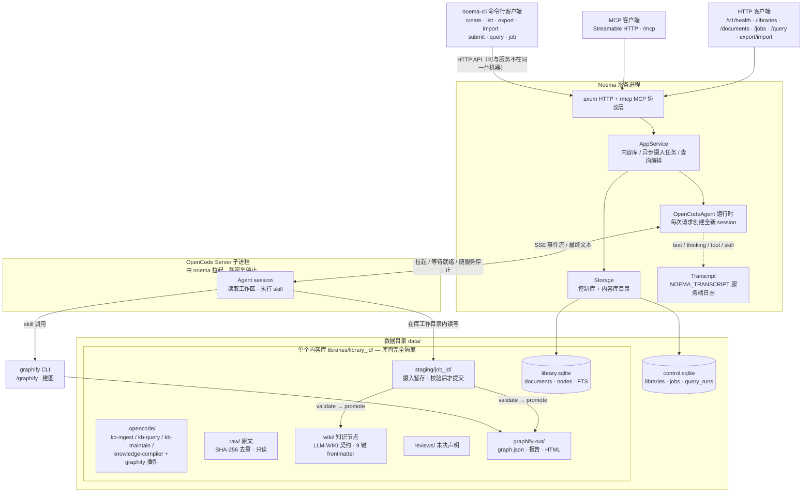

# Noema

Noema 是由 OpenCode 驱动的文本知识库服务。服务负责内容库、原文、任务和对外协议；OpenCode 负责读取工作区、调用 graphify、编译知识节点并回答查询。

每个内容库都有独立的 OpenCode project、原文、Wiki 节点、图谱产物、索引和 SQLite 文件。查询只接受自然语言 prompt，每次查询都会创建一个新的 OpenCode session。

## 架构



三条进程边界：Noema 服务、OpenCode Server、graphify CLI。OpenCode Server 是 noema 拉起的子进程（启动时等待就绪、Ctrl-C 时一并停止）。Noema 管理内容库、任务与对外协议，并校验摄入产物后才提交；OpenCode Agent 只在一个内容库的工作目录内读写；graphify 产物按库生成。所有管理操作（添加文档、导入导出、查询）都经 HTTP API（`/v1/...`）进行，命令行客户端 `noema-cli` 是对它的封装，允许在与服务不同的机器上操作；快照是单个内容库的完整副本，库与库之间不共享任何文件。

## 依赖

- Rust stable
- `opencode` 可执行文件（取 PATH 上的 `opencode`）：noema 自行拉起并管理 OpenCode Server 子进程
- `graphify` CLI。创建内容库时执行 `graphify install --platform opencode --project`
- 本地 OpenCode SDK：`/mnt/data/code/agentic_auxilary/crates/services/opencode-rs`

## 启动

noema 自行拉起并管理 OpenCode Server 子进程：绑定 127.0.0.1 并自动选取空闲端口，启动时等待其就绪再对外服务，Ctrl-C 时随服务一并停止。实际地址见 `/v1/health` 返回的 `opencode_url`。

```bash
NOEMA_DATA_DIR=data cargo run
```

模型默认用内置的 `opencode/deepseek-v4-flash-free`，可用 `--model` 或 `OPENCODE_MODEL` 覆盖。

所有配置项同样可以用命令行参数直接传入（环境变量是回退项），完整列表见 `cargo run -- --help`。

常用配置：

| 环境变量 | 默认值 | 作用 |
| --- | --- | --- |
| `NOEMA_BIND` | `127.0.0.1:8787` | Noema 监听地址 |
| `NOEMA_DATA_DIR` | `data` | 服务数据目录 |
| `OPENCODE_MODEL` | `opencode/deepseek-v4-flash-free` | 模型标识 |
| `OPENCODE_TIMEOUT_SECS` | `1800` | 单个 Agent session 超时 |

OpenCode session 当前显式允许全部权限，但关闭交互式 `question` 工具（服务没有用户回答回路）。内容库的工作目录、摄入暂存目录和服务侧提交校验仍由 Noema 管理；这不是面向不受信任租户的主机级沙箱。

## HTTP API

健康检查：

```bash
curl http://127.0.0.1:8787/v1/health
```

创建内容库：

```bash
curl -X POST http://127.0.0.1:8787/v1/libraries \
  -H 'content-type: application/json' \
  -d '{"name":"产品知识库","description":"产品设计和使用文档"}'
```

提交 UTF-8 Markdown/TXT 文档：

```bash
curl -X POST http://127.0.0.1:8787/v1/libraries/<library_id>/documents \
  -H 'content-type: application/json' \
  -d '{"filename":"session-context.md","content":"# Session Context\n\n文档内容"}'
```

摄入是异步任务，可通过下面的接口轮询：

```text
GET /v1/libraries/{library_id}/jobs/{job_id}
```

自然语言查询：

```bash
curl -X POST http://127.0.0.1:8787/v1/libraries/<library_id>/query \
  -H 'content-type: application/json' \
  -d '{"prompt":"解释 Session Context 的主要设计和证据来源"}'
```

导出内容库快照（返回 gzip tar 归档；路径参数接受内容库 id，或唯一的名称）：

```bash
curl -o base-regulations.tar.gz \
  http://127.0.0.1:8787/v1/libraries/<library_id>/export
```

导入快照（请求体即归档；始终创建一个全新的内容库，成功返回 201 和新库 JSON；`name`/`description` 可选，缺省取快照记录的元数据）：

```bash
curl -X POST --data-binary @base-regulations.tar.gz \
  'http://127.0.0.1:8787/v1/libraries/import?name=用户A法规库'
```

快照语义见命令行客户端一节：快照是单个内容库的完整副本（含 graphify 产物、wiki 节点和 library.sqlite），导入始终新建内容库，失败完整回滚，含路径穿越、符号链接或硬链接的归档一律拒绝（400）。

## MCP

对外 MCP 端点是标准 Streamable HTTP：

```text
POST /mcp
```

首期工具：

- `kb_ingest_document`
- `kb_query`
- `kb_job_status`
- `kb_health`

MCP 工具都显式接收 `library_id`（健康检查除外）。Noema 不提供 stdio MCP 入口，也不会把自定义知识库 MCP 工具注入 OpenCode；OpenCode 直接使用当前内容库工作区和已安装 Skill。

## 命令行客户端（noema-cli）

`noema-cli` 是 HTTP API 的命令行封装——所有操作都经过运行中的 `noema` 服务，可以和服务不在同一台机器（地址用 `--server` 或 `$NOEMA_SERVER` 指定，默认 `http://127.0.0.1:8787`）：

```bash
noema-cli health
noema-cli create 基础法规库
noema-cli list
noema-cli export 基础法规库 -o base-regulations.tar.gz
noema-cli import base-regulations.tar.gz --name 用户A法规库
noema-cli submit 用户A法规库 ./my-regulation.md
noema-cli job 用户A法规库 <job_id>
noema-cli query 用户A法规库 "第一条讲了什么？"
```

导出把服务端生成的快照下载到本地文件，导入把本地归档上传给服务端；提交文档时读取本地 `.md`/`.txt` 并上传内容。导入语义：始终新建内容库，失败完整回滚，含路径穿越或符号/硬链接的归档一律拒绝（服务端返回 400，客户端非零退出并打印错误）。

快照是一个内容库的完整副本（gzip tar）：`raw/` 原文、`wiki/` 知识节点（LLM-WIKI 编译产物）、`reviews/`、`graphify-out/` 图谱产物、`.opencode/` Skill 与插件、`library.sqlite`（去重与索引记录）。归档不含 `staging/`、运行时状态（`node_modules`、会话记录、SQLite sidecar）和任何符号链接。

导入始终创建一个全新的内容库：新 id、新目录、独立数据库，失败时完整回滚。不同内容库完全隔离——不共享任何文件、不互相引用，跨库复用只通过"导出 → 导入"的副本发生。内容库名称只是别名，导入时可以随意重命名、可以重名；知识的身份由节点内的 `node_id` 承载。若快照缺少 `.opencode/`，导入会执行 graphify 安装器补齐（需要 graphify CLI）。

典型复用流程：团队维护一份基础法规库，导出快照后分发给各用户；每个用户导入到自己的数据目录，再通过正常摄入流程增量添加自己的法规（摄入 Agent 执行 graphify `--update` 增量建图）。

## 测试

`tests/service.rs` 和库内单元测试通过假 OpenCode runtime 覆盖服务层（摄入、查询、内容库隔离、SHA-256 去重、graphify 增量建图提示词）、HTTP 与 Streamable HTTP MCP 挂载和快照导入导出；`tests/cli.rs` 拉起真实 `noema` 及其 OpenCode Server 子进程，验证 noema-cli 经 HTTP 的导出→导入往返和恶意归档拒绝。建库会真实执行 graphify 安装器（离线可用）；不需要模型或网络，但 PATH 上需要 `opencode` 与 `graphify`：

```bash
cargo test
```

服务端可以流式打印 OpenCode 会话的中间过程（text / thinking / tool / skill 调用与结果、step 统计），仅用于服务端日志，HTTP 与 MCP 接口始终只返回最终文本回答。设置 `NOEMA_TRANSCRIPT=1` 启用（终端下自动带颜色，遵循 `NO_COLOR`）：

```bash
NOEMA_TRANSCRIPT=1 noema
```

## 内容库与 Skill

创建内容库时，Noema 会在该内容库项目中直接运行上游 graphify 安装器，并写入中文的 `kb-ingest`、`kb-query`、`kb-maintain` 和独立设计的 `knowledge-compiler` Skill。LLM-WIKI 只作为设计参考，不原样复制。

内容库的 graphify 生命周期是：空内容库只安装插件和 Skill；首篇文本文档摄入时由 OpenCode 执行完整的 `/graphify .`；已有图谱后，新文档或变更文档摄入时执行 `/graphify . --update` 增量更新。

数据默认位于：

```text
data/
├── control.sqlite
└── libraries/{library_id}/
    ├── .opencode/
    ├── raw/
    ├── wiki/
    ├── reviews/
    ├── staging/
    ├── graphify-out/
    ├── purpose.md
    ├── schema.md
    ├── .graphifyignore    # 上游 graphify 的输入边界：只包含 raw/ 和 wiki/
    ├── index.md
    ├── manifest.json
    └── library.sqlite
```

`raw/` 中只接收单文件名的 `.md` 和 `.txt` 文档，原文按 SHA-256 去重并保持不变。摄入 Agent 在 `staging/{job_id}` 中工作，成功后服务才提交允许的知识产物。
