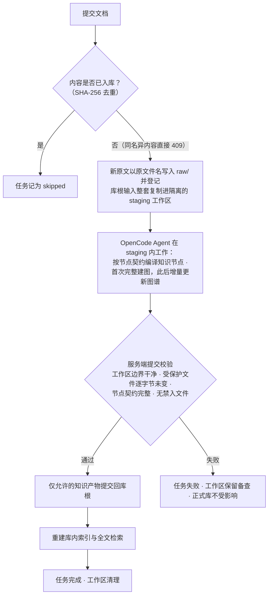
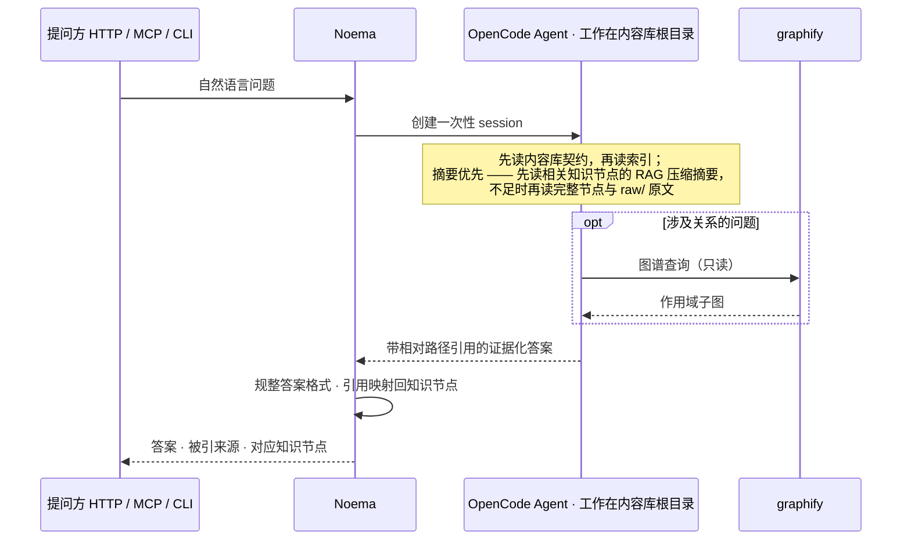
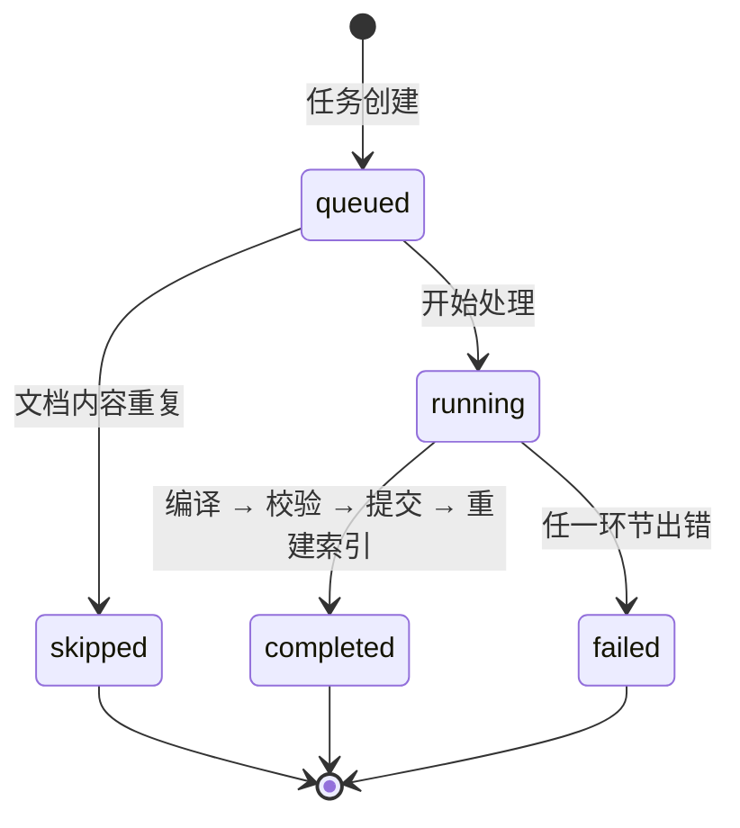
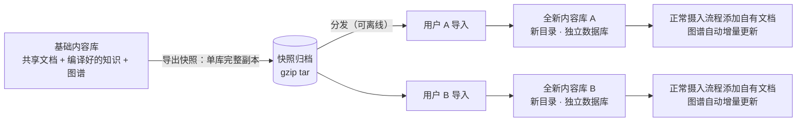

# Noema

Noema 是由 OpenCode 驱动的文本知识库服务：提交 `.md`/`.txt` 文档，Agent 将其编译成 LLM-WIKI 风格的知识节点并构建知识图谱，之后的自然语言查询基于库内证据作答、携带引用。

三方分工：**Noema 服务**管边界与规则（协议、任务、校验、进出库）；**OpenCode Agent** 负责知识生产（编译节点、建图、回答问题）；**graphify** 作为 Agent 的技能提供图谱构建与查询。每个内容库都是完全隔离的世界——独立的文件、独立的数据库、独立的 OpenCode 项目，库与库不共享、不互引，跨库的唯一途径是"导出 → 导入"快照副本。

所有管理能力都经 HTTP API 暴露；`noema-cli` 命令行客户端与 MCP 端点是同一套能力的两种形态，命令行可以远程操作服务。

## 前置要求

| 依赖 | 要求 | 说明 |
| --- | --- | --- |
| Rust | stable（edition 2024，≥ 1.85） | 用于 `cargo install` 编译安装 |
| `opencode` | 可执行文件在 PATH 上 | noema 启动时自行拉起并管理 OpenCode Server 子进程（`opencode serve`，127.0.0.1 自动选空闲端口），Ctrl-C 时一并停止 |
| OpenCode 模型凭据 | 已通过 `opencode` 配置 | 凭据由 OpenCode 自身管理，noema 不接触任何 API key |
| `graphify` | 可执行文件在 PATH 上 | 创建内容库与导入缺 `.opencode/` 的快照时，noema 运行其安装器（`graphify install --platform opencode --project`）；摄入过程中由 Agent 以 skill 调用 |
| `opencode_rs` | git 依赖：GitHub `allisoneer/agentic_auxilary` | Cargo.toml 中经 git 源引入，构建机能访问 GitHub 即可 |

平台：Linux（服务依赖 Unix 信号与 UTF-8 文件系统；内容库名与文档名支持中文）。

## 安装

```bash
cd noema
cargo install --path .
```

安装两个二进制到 `~/.cargo/bin`（确保它在 PATH 上）：

- `noema` —— 服务端；
- `noema-cli` —— 命令行客户端（可指向远端服务）。

## 快速上手

终端 1，启动服务（数据目录建议用绝对路径，缺省是当前目录下的 `data/`）：

```bash
noema --data-dir ~/.local/share/noema
```

终端 2，走完一轮"建库 → 提交 → 等待摄入 → 查询"：

```bash
noema-cli status                          # 健康检查 + 数据目录与模型配置
noema-cli create 产品知识库                # 库名即 id、即目录名，全服务唯一
noema-cli submit 产品知识库 ./design.md    # 触发异步摄入，返回 job_id
noema-cli job 产品知识库 <job_id>          # 轮询到 completed
noema-cli query 产品知识库 "Session Context 是怎么设计的？"
```

查询输出是 Agent 基于库内证据写出的 Markdown 答案，末尾附被引来源（原文路径 → 对应知识节点两级追溯）。

## noema 服务

```bash
noema [--bind 127.0.0.1:8787] [--data-dir data] [--model <MODEL>] \
      [--opencode-timeout-secs 1800] [--max-sessions 4] [--auth-token <TOKEN>] [--transcript]
```

所有参数都是"命令行标志 → 环境变量 → 内置默认"三级回退：

| 标志 | 环境变量 | 默认值 | 作用 |
| --- | --- | --- | --- |
| `--bind` | `NOEMA_BIND` | `127.0.0.1:8787` | 监听地址 |
| `--data-dir` | `NOEMA_DATA_DIR` | `data` | 数据目录（控制库 + 所有内容库） |
| `--model` | `OPENCODE_MODEL` | `opencode/deepseek-v4-flash-free` | Agent 使用的模型标识 |
| `--opencode-timeout-secs` | `OPENCODE_TIMEOUT_SECS` | `1800` | 单个 Agent session 超时（秒） |
| `--max-sessions` | `NOEMA_MAX_SESSIONS` | `4` | 全局并发 Agent session 上限（摄入 + 查询），超出的排队等待 |
| `--auth-token` | `NOEMA_AUTH_TOKEN` | 无（API 开放） | HTTP API 的 Bearer 令牌（见下） |
| `--transcript` | `NOEMA_TRANSCRIPT` | `false` | 实时打印会话中间过程（见下） |

日志走 `RUST_LOG`（缺省 `noema=info,tower_http=info`）。

### `--auth-token`：API 鉴权

HTTP API 默认无鉴权，前提是只绑定 loopback。需要跨机器或经容器网络访问时，用
`--auth-token`（或 `NOEMA_AUTH_TOKEN`）启用 Bearer 鉴权：设置后除 `/v1/health`
（供容器探针免凭据探活）外，所有路由与 MCP 端点都必须携带
`Authorization: Bearer <token>`，否则一律 `401`。绑定非 loopback 地址而未设置
令牌时，启动会打印警告。`noema-cli` 用同名全局参数/环境变量携带令牌：

```bash
noema --bind 0.0.0.0:8787 --auth-token "$NOEMA_AUTH_TOKEN"
noema-cli --server http://<host>:8787 --auth-token "$NOEMA_AUTH_TOKEN" status
```

### `--transcript`：会话实录

开启后，服务端 stderr 实时打印每个 OpenCode 会话的中间过程：assistant 文本、推理、工具与 skill 调用及结果、step 统计与 token/费用。这是**纯服务端可观测性**——HTTP 与 MCP 接口始终只返回最终答案。模型的长段自述按部件截取预览（其余以"另有约 N 字未显示"带过），工具参数中的路径完整显示；终端下自动着色，遵循 `NO_COLOR`/`FORCE_COLOR`。

```bash
noema --transcript              # 裸标志即开启
noema --transcript=false        # 显式关闭（覆盖环境变量时）
```

### 受管的 OpenCode 子进程

服务启动时在 127.0.0.1 选取空闲端口拉起 `opencode serve`，等待就绪后才对外服务；实际地址见 `/v1/health` 的 `opencode_url`。OpenCode session 当前显式允许全部权限、但关闭交互式 `question` 工具（服务没有用户回答回路）。内容库工作目录、摄入暂存目录和服务侧提交校验仍由 Noema 管理——这不是面向不受信任租户的主机级沙箱。

## noema-cli 命令行客户端

所有操作都经过运行中的 `noema` 服务，可以和服务不在同一台机器（`--server` 或 `$NOEMA_SERVER`，缺省 `http://127.0.0.1:8787`）。服务启用鉴权时，用全局参数 `--auth-token`（或 `$NOEMA_AUTH_TOKEN`）携带令牌。库选择器（下表的 `<lib>`）接受库名——新建库的库名即 id，二者等价。

| 命令 | 作用 |
| --- | --- |
| `noema-cli status` | 健康检查，显示数据目录、OpenCode 地址与模型 |
| `noema-cli create <名称> [--description <描述>]` | 创建内容库（名称唯一；重名返回 409） |
| `noema-cli list` | 列出所有内容库（id / 名称 / 路径） |
| `noema-cli submit <lib> <file.md\|file.txt> [--title <标题>]` | 提交本地文档，触发异步摄入 |
| `noema-cli job <lib> <job_id>` | 查询摄入任务状态 |
| `noema-cli query <lib> "<自然语言问题>"` | 自然语言查询（每次创建全新 Agent session） |
| `noema-cli export <lib> [-o <文件>]` | 导出快照到本地 `.tar.gz` |
| `noema-cli import <归档> [--name <名称>] [--description <描述>]` | 导入快照为全新内容库 |

## 命名规则

名字即身份，不做任何改写（不加哈希前缀、不拼随机后缀、不做拼音转写）：

- **内容库**：库名 NFC 归一化后原样用作 id 与目录名（`libraries/产品知识库/`），全服务唯一；重名创建返回 `409 Conflict`。名称不得含路径分隔符与控制字符，不超过文件系统的 255 字节限制。
- **文档**：原文件名存入 `raw/`（`raw/design.md`）。同内容重复提交（SHA-256 相同）返回 `duplicate: true` 并跳过摄入；**同名不同内容返回 409**——`raw/` 是只进不出的证据层，改名再传而不是覆盖。
- 兼容：历史数据中带随机后缀的旧式 id 照常工作；旧数据中若存在重名库，按名称选择会返回 400 并要求改用 id。

## 架构

### 设计原则

- **一库一世界**：每库独立全套文件、数据库与 OpenCode 项目；跨库只有"导出 → 导入"副本。
- **先校验后入库**：Agent 只在暂存副本上工作，知识产物经服务端校验才进入正式库；失败时正式库一个字节不变。
- **唯一对外入口**：一切管理能力经 HTTP API；MCP 与 CLI 是同一能力的两种形态。
- **证据可追溯**：节点声明来源，回答携带引用，服务端把引用映射回知识节点；任务与查询留有可审计历史。

### 分层与依赖层级


依赖关系单向向下：客户端只与协议层交互，协议层只做协议翻译，业务规则只存在于业务编排层。

### 内容库目录与文件结构

```text
data/                                  数据根目录（NOEMA_DATA_DIR）
├── control.sqlite                     控制面：内容库注册、摄入任务、查询历史
├── jobs/                              快照导入临时目录（导入结束必定清理）
└── libraries/{库名}/                   一个内容库（目录名即库名，唯一）—— 与其他库完全隔离
    ├── purpose.md                     内容库定位：范围、关键问题、术语、更新政策
    ├── schema.md                      知识节点契约的人类可读声明
    ├── index.md                       全库知识索引（派生，提交后重建）
    ├── manifest.json                  原文清单（派生）
    ├── .graphifyignore                graphify 输入边界：只含 raw/ 与 wiki/
    ├── AGENTS.md                      Agent 行为说明（graphify 安装器写入）
    ├── library.sqlite                 库内数据库：原文去重、节点注册、全文检索
    ├── .opencode/                     OpenCode 项目：四个 Noema Skill、graphify 插件与配置
    ├── raw/                           原文：.md/.txt、原文件名存储、SHA-256 去重（同名异内容拒绝）、入库后只读
    ├── wiki/                          知识节点：LLM-WIKI 契约、9 键 frontmatter
    ├── reviews/                       未解决的声明与低置信度关系
    ├── graphify-out/                  图谱产物：graph.json、报告、交互 HTML、增量缓存
    └── staging/{job_id}/              摄入工作区：库根输入的副本，校验通过才提交
```

读写职责与边界：

| 目录 / 文件 | 业务角色 | 写入方 | 边界约束 |
| --- | --- | --- | --- |
| `raw/` | 事实来源，一切知识的证据基础 | Noema（提交文档） | SHA-256 去重、原文件名存储（同名异内容拒绝）、写入后只读；Agent 不得修改 |
| `wiki/` | 编译后的知识节点 | Agent（经 staging 提交） | frontmatter 恰好 9 键；正文含定义 / 证据 / 示例 / 局限 / RAG 压缩摘要 / 引用 |
| `reviews/` | 未解决的冲突与低置信度结论 | Agent（经 staging 提交） | 与正式知识分离，留待人工或后续任务处理 |
| `graphify-out/` | 知识图谱、报告与增量缓存 | graphify（经 staging 提交） | 输入被限定为 `raw/` + `wiki/`；只服务图谱查询 |
| `index.md` · `manifest.json` · `library.sqlite` | 派生索引与去重记录 | Noema 自动重建 | 不手写；永远由原文、知识节点和库内数据库再生 |
| `staging/{job_id}/` | 摄入隔离工作区 | Noema 创建与清理 | 成功则提交允许的知识产物并清理；失败则保留备查。终态残留另由调和收敛：服务启动时清扫一遍，任务完成后延迟复查一次 |
| `purpose.md` · `schema.md` · `.graphifyignore` | 内容库契约与边界 | 建库时种入 | 摄入校验要求逐字节未变 |
| `.opencode/` · `AGENTS.md` | Agent 能力与行为说明 | Noema 与 graphify 安装器 | 建库与快照导入时写入/刷新；不属于知识提交物 |

### 摄入业务流



提交是"Agent 产出"与"库内知识"的分界线：Agent 完成前正式库一个字节不变，校验失败后同样不变。失败的工作区留在磁盘上，配合任务错误信息可反复排查。

### 查询业务流



查询全程不写任何知识文件；session 用完即销毁，只在控制面留下查询历史。引用指向原文时，服务端同时附上对应的知识节点（若存在），形成"原文 → 节点"两级追溯。引用提取支持中文文件名。

### 摄入任务与查询状态



查询历史复用其中 `running / completed / failed` 子集。任务错误信息与失败时保留的 staging 工作区是排障依据。

同一内容库的摄入作业串行执行：后到的作业等前一个完成后再开始，等待期间保持 `queued`（轮询 job 状态可见排队），因此每次摄入都在上一次提交的图谱之上增量更新，并行提交不会相互覆盖。不同内容库之间完全并行；查询不受摄入排队影响，只与摄入共享全局 `--max-sessions` 上限。

### 隔离与快照复用



## 内容库与 Skill

创建内容库时，Noema 在该项目中运行上游 graphify 安装器，并写入中文的 `kb-ingest`、`kb-query`、`kb-maintain` 和独立设计的 `knowledge-compiler` Skill（LLM-WIKI 只作设计参考，不原样复制）。

graphify 生命周期：空库只安装插件和 Skill；首篇文档摄入时执行完整 `/graphify .`；已有图谱后，新文档摄入执行 `/graphify . --update` 增量更新。

## HTTP API

| 方法与路径 | 作用 |
| --- | --- |
| `GET /v1/health` | 健康检查（数据目录、OpenCode 地址、模型） |
| `GET /v1/libraries` | 列出内容库 |
| `POST /v1/libraries` | 创建内容库（`{"name","description"}`；重名 409） |
| `POST /v1/libraries/import` | 导入快照（请求体为 gzip tar；`?name=&description=` 可选） |
| `GET /v1/libraries/{library_id}/export` | 导出快照（返回 gzip tar） |
| `POST /v1/libraries/{library_id}/documents` | 提交文档（`{"filename","content","title"}`；同名异内容 409） |
| `GET /v1/libraries/{library_id}/jobs/{job_id}` | 摄入任务状态 |
| `POST /v1/libraries/{library_id}/query` | 自然语言查询（`{"prompt"}`） |

`{library_id}` 路径段接受库名（新库名即 id）；URL 中的中文名按标准百分号编码。错误以 `{"error": "..."}` 返回：400 请求非法、404 库/任务不存在、409 名称冲突、502 Agent 运行时失败。

示例：

```bash
curl http://127.0.0.1:8787/v1/health

curl -X POST http://127.0.0.1:8787/v1/libraries \
  -H 'content-type: application/json' \
  -d '{"name":"产品知识库","description":"产品设计和使用文档"}'

curl -X POST http://127.0.0.1:8787/v1/libraries/产品知识库/documents \
  -H 'content-type: application/json' \
  -d '{"filename":"session-context.md","content":"# Session Context\n\n文档内容"}'

curl -X POST http://127.0.0.1:8787/v1/libraries/产品知识库/query \
  -H 'content-type: application/json' \
  -d '{"prompt":"解释 Session Context 的主要设计和证据来源"}'
```

## MCP

Streamable HTTP 端点 `POST /mcp`，工具：`kb_ingest_document`、`kb_query`、`kb_job_status`、`kb_health`。除健康检查外都显式接收 `library_id`。Noema 不提供 stdio MCP 入口，也不把自定义知识库工具注入 OpenCode——OpenCode 直接使用内容库工作区与已安装 Skill。

## 快照格式

快照是单个内容库的完整副本（gzip tar）：`raw/` 原文、`wiki/` 知识节点、`reviews/`、`graphify-out/` 图谱产物、`.opencode/` Skill 与插件、`library.sqlite` 去重与索引记录，外加清单 `noema-snapshot.json`（格式、版本、库名、来源 id）。归档**不含** `staging/`、运行时状态（`node_modules`、会话记录、SQLite sidecar）和任何符号链接。

导入语义：

- 始终新建内容库（新目录、独立数据库），失败完整回滚；
- 库名缺省取快照记录的名称，与现有库重名返回 409，用 `--name`/`?name=` 改名；
- 含路径穿越、符号链接或硬链接的归档一律拒绝（400）；
- 快照缺 `.opencode/` 时执行 graphify 安装器补齐。

典型复用：团队维护一份基础法规库，导出快照分发给各用户；各用户导入后通过正常摄入增量添加自有文档（图谱自动增量更新）。

## 测试

```bash
cargo fmt && cargo clippy --all-targets -- -D warnings && cargo test
```

- 库内单元测试 + `tests/service.rs`：假 OpenCode runtime 覆盖服务层（摄入、查询、内容库隔离、SHA-256 去重、库名与文件名唯一性、NFC 归一化、CJK 引用提取、graphify 增量建图提示词）、HTTP 与 MCP 挂载、快照导入导出与恶意归档拒绝；
- `tests/cli.rs`：拉起真实 `noema` 及其 OpenCode Server 子进程，验证 noema-cli 经 HTTP 的导出→导入往返。建库真实执行 graphify 安装器（离线可用）；不需要模型或网络，但 PATH 上需要 `opencode` 与 `graphify`。
